# Simple-Blog-w-Flask
This repo contains code for a simple flask-blog application using Flask and it's libraries for web development.

This project is a template for a simple blog website with User Login/Signup, Post CRUD operations on a web interface.

The project is built using HTML, CSS, Bootstrap, Python, Flask, SQL and Jinja Logics.

## Steps To Reproduce:
For project to run make sure you have a working version of Python 3.X (3.7) being used in the project.
Clone the repoto your local system and then after opening the terminal in the repo directory run the following command to install the requirements.

    pip install -r requirements.txt
        or
    pip3 install -r requirements.txt

Then to run the project open terminal and run the following command:

    python app.py

To access the website just browse the following on your browser:
    
    localhost:5000

## Snapshots:
### Home Page
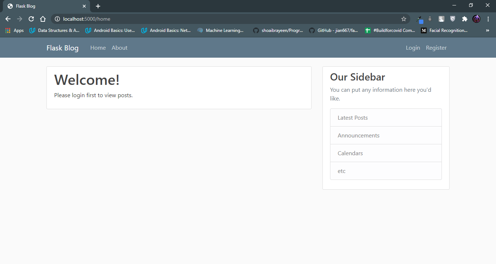

### Registration Page
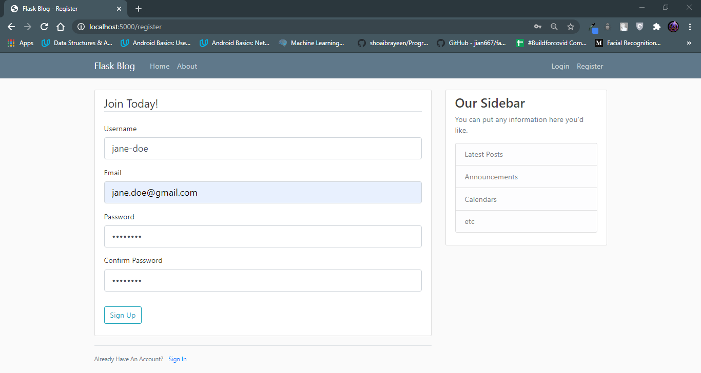

### Login Page
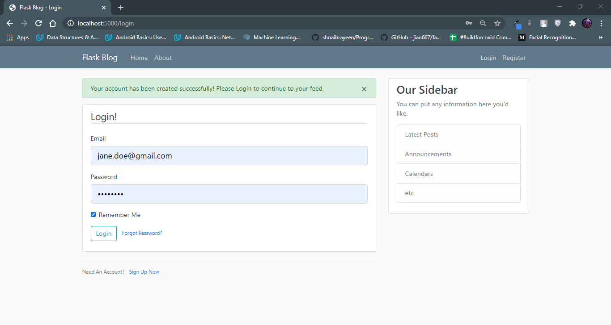

### Home Page After Login
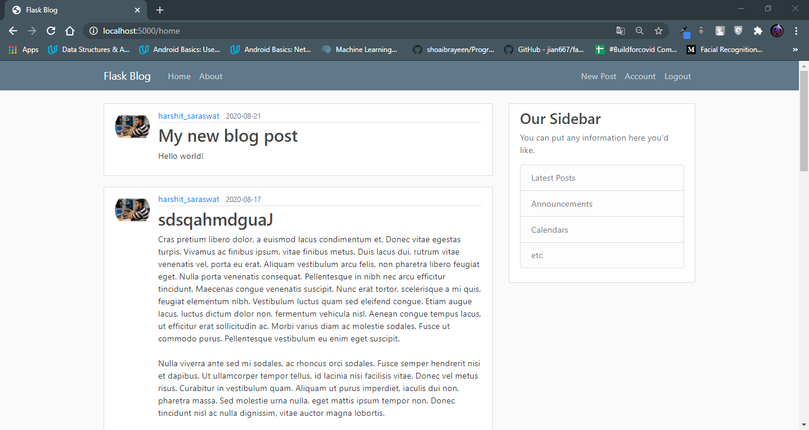

### Pagination on various pages
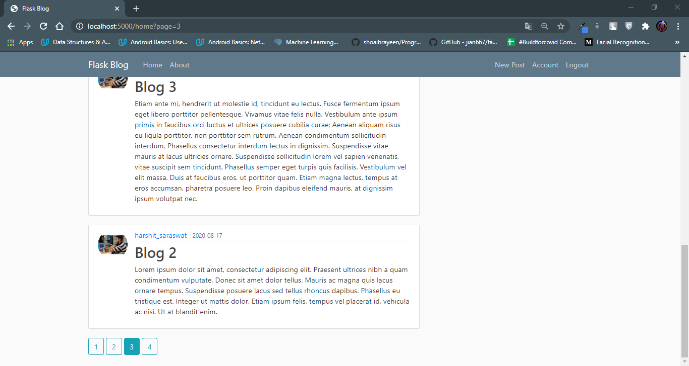

### Account Page
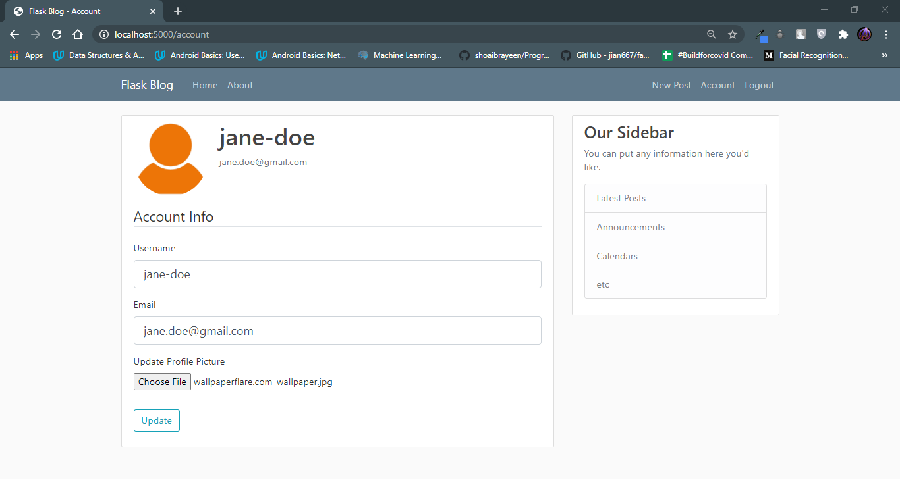

### New Post Page
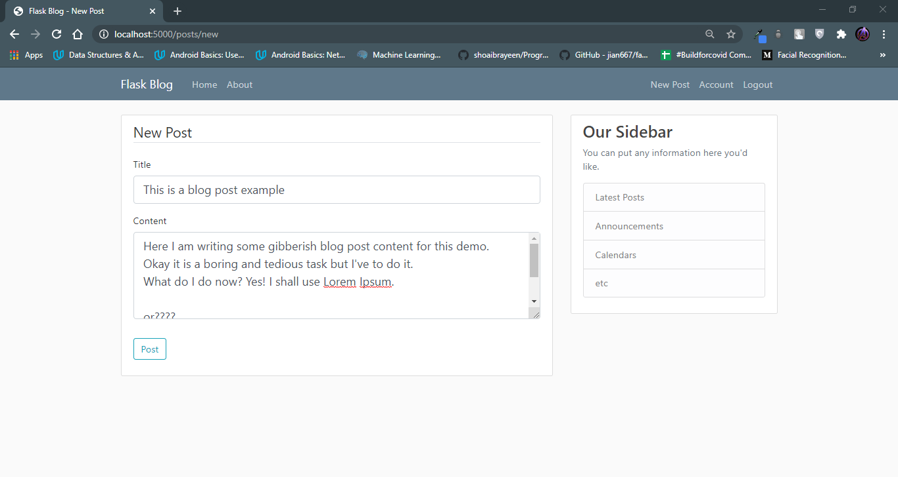

### Home Page after Post
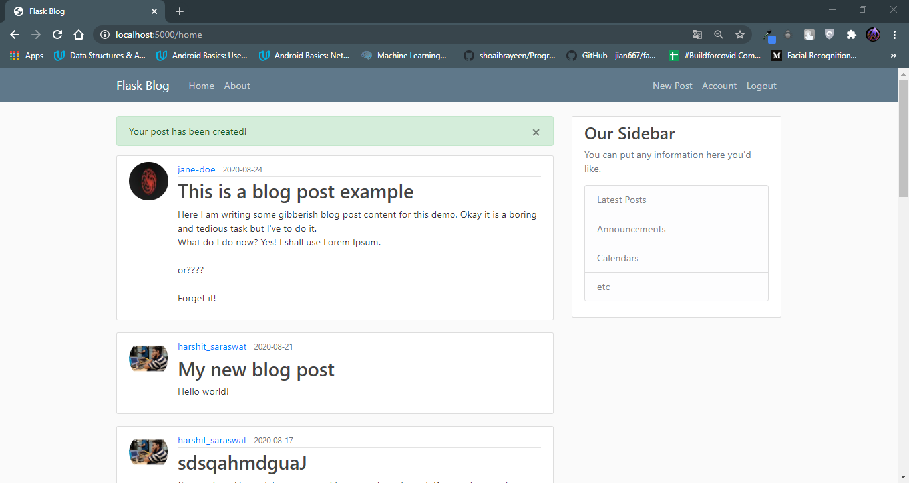

### Posts By User Page
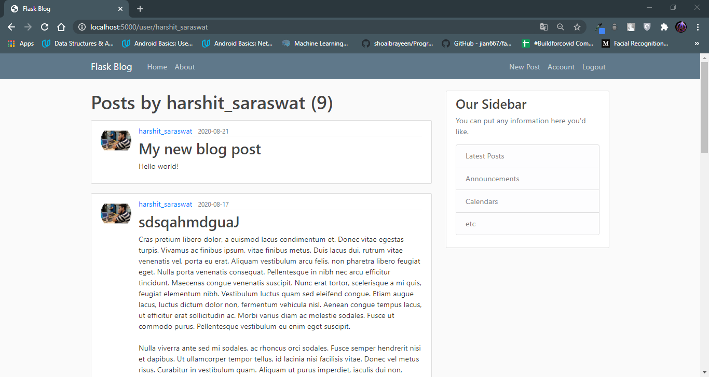

### Delete Post Page

### Update Post Page
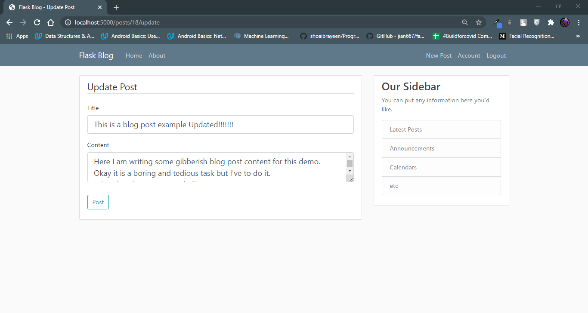

### Forgot Password Page

### Reset Password Page
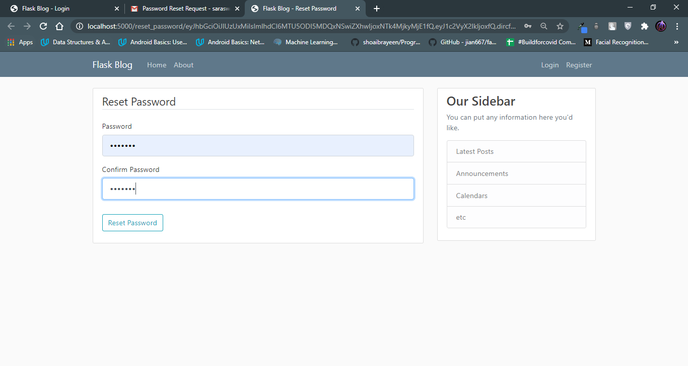

### Page Responsiveness
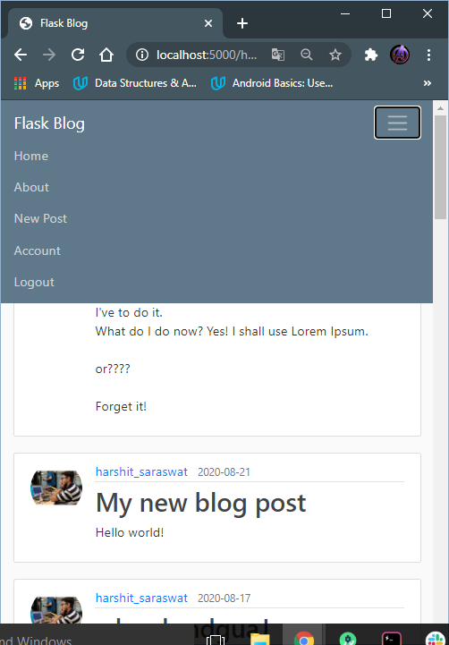

### About Page
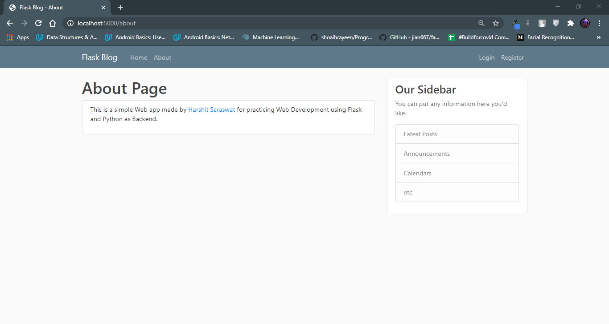

## Inspiration:
The inspiration for the website have been taken from the follwing:
* [Simple Personal Diary](https://github.com/harshit-saraswat/Personal-Blog-Diary-Website)- This is my project from Complete Web Development Bootcamp Course using HTML, CSS, JS, NodeJS, ExpressJS and EJS. I though of making a Python/Flask based version of it with additional features.
I am following Corey Schafer's Flask Playlist on [YouTube](https://www.youtube.com/playlist?list=PL-osiE80TeTs4UjLw5MM6OjgkjFeUxCYH) for this project.

## Acknowledgements:
I'd like to express my greatest gratitude towards [Corey Schafer](https://github.com/CoreyMSchafer) for his amazing teaching efforts and flask playlist.
For the website I've used the following resources:
* ***Icons***: [FlatIcons](https://www.flaticon.com/)
* ***Fonts***: [GoogleFonts](https://fonts.google.com/)
* ***Bootstrap***: [Bootstrap](https://getbootstrap.com/)
* ***External Packages***: [PyPI](https://pypi.org/)
